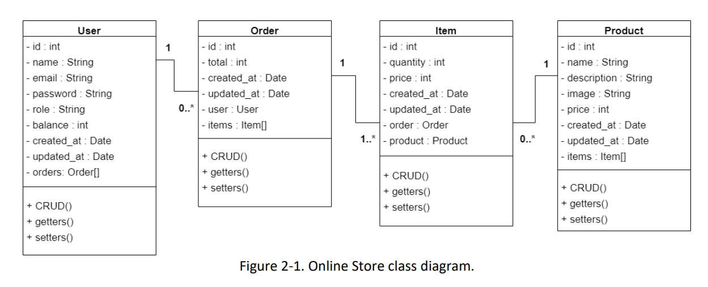
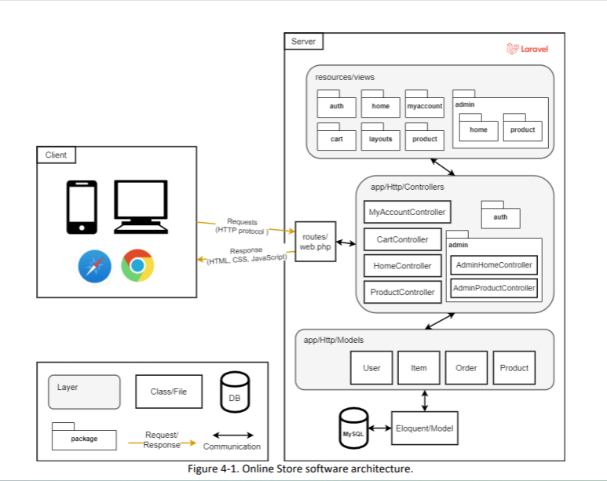
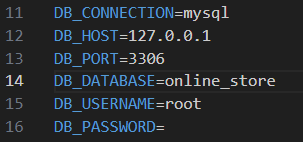
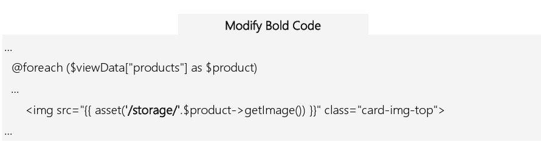
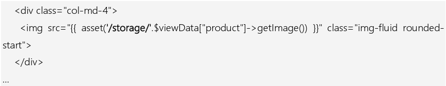
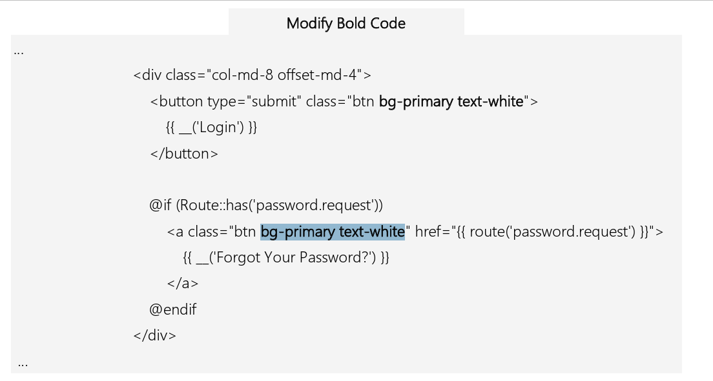
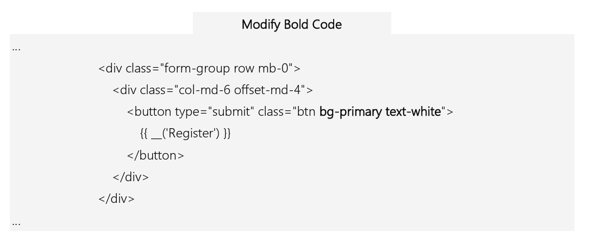
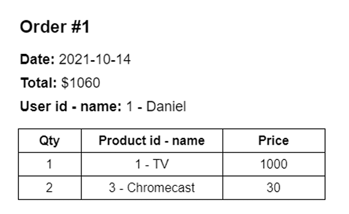
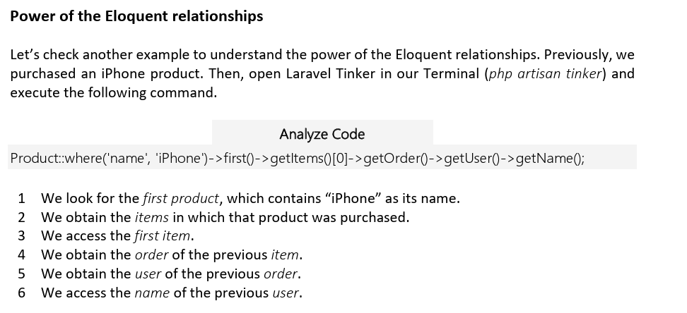
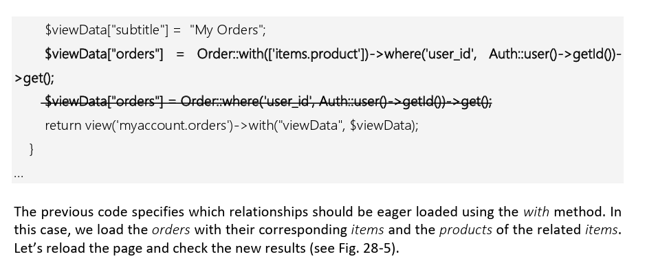

# Practical_Laravel_Online_Store



## 1. Installation

Version: [Laravel 9](https://laravel.com/)

Requirements:

- XAMPP: [XAMPP](https://www.apachefriends.org/download.html) is the most popular PHP development enviroment. Is an Apache distribution containg MySQL, PHP, and Perl. **YOU WILL NEED TO DOWNLOAD AND INSTALL A XAMPP VERSION WHICH SUPPORTS PHP 8. BECAUSE LARAVEL 9 REQUIRES PHP 8**.
- Composer: Is a tool for dependency managment in PHP.

## 2. Create a new Laravel project using composer:

```
composer create-project laravel/laravel onlineStore "9.*" --prefer-dist
```

```
cd onlineStore
```

```
php artisan serve
```

## 3. MVC Architectural Pattern:



## 4. View Layout:

Requirements:

- **Blade**: Is a templating engine that is included in Laravel.

  Extencion -> .blade.php

  Stored -> resources/views

- **Bootsrap**: CSS Framework.

### 4.1 Blade layout:

- Create a folder called "layout" under the resources/views directory.
- Use a [bootsrap starter template](https://getbootstrap.com/docs/5.1/getting-started/introduction/).
- Create a file called "app.blade.php" under the resources/views/layout directory.
- Modify esources/views/welcome.blade.php. It extends the layouts.app view

### 4.2 Customize CSS styles:

- Create a folder "styles" under the "public/" directory.
- Then, in public/css, create a new file app.css
- Finally, in resources/views/layouts/app.blade.php, include the previous CSS file.

Laravel includes a variety of global helper PHP functions. For example, the asset function generates
a URL for an asset using the current scheme of the request (HTTP or HTTPS). Since our css/app.css
file is inside the public folder, it will be automatically deployed over our server link (i.e.,
http://127.0.0.1:8000/css/app.css). We used curly braces {{ }} to invoke the asset function. Curly
braces are used in Blade files to display data passed to the view or invoke Laravel helpers. In the
end, we created a footer section with the book’s author names and links to their Twitter accounts.

[This design was inspired by a free Bootstrap template called Freelancer](https://startbootstrap.com/theme/freelancer)

### 4.2 Index and about pages:

#### Index view:

- The home page currently just displays a welcome message. Let’s create a new index view. In resources/views/, create a subfolder home. In resources/views/home, create a new file index.blade.php.

- We defined some divisions to display some images. We need to download these images and store them in our public folder. First, in the public folder, create a subfolder img. Then, download the images and store them inside the public/img folder.

#### About view:

- In resources/views/home, create a new file about.blade.php

**We have a simple view that displays a description of the application and some information about
the author. We will pass four variables from a controller to this view later. Remember that Blade
allows curly braces to display data passed to the view.**

## 5. Laravel Routing (routes):

Laravel Routing is a mechanism used to route all your application requests to specific methods or functions which will deal with those specific requests.

- **routes/web.php:** Defines routes for your web interface. MODIFY THIS FILE!
- **routes/api.php:** Defines routes for your API (if you have one). These are routes used in service-oriented architectures or REST APIs.

## 6. Laravel Controlers:

Controllers can group related request handling logic into a single class. For example, a UserController class might handle all incoming requests related to users, including showing, creating, updating, and deleting users.

- In **app/Http/Controllers**, create a new file HomeController.php

## 7. Coding Standar: PHP_CodeSniffer:

Is a ser og two PHP scripts.

```
composer require --dev squizlabs/php_codesniffer
```

- We will apply a quick configuration of PHP_CodeSniffer. In the project root directory, create a new file phpcs.xml

- Running PHP_CodeSniffer:

```
./vendor/bin/phpcs
```

- Correct the found mistakes:

```
./vendor/bin/phpcbf
```

## 8. List products with Dummy Data:

- Let’s start by including a couple of routes (routes/web.php) to list products and show the data of a single product.
  We will list all the application products in the first route (“/products”). The second route will be used to show the data of a single product. “/products/{id}” takes a parameter called id.

- Both routes are connected to the ProductController. So, let’s implement it. In app/Http/Controllers, create a new file ProductController.php

- Create the product view. In resources/views/, create a subfolder product. Then, in resources/views/product, create a new file index.blade.php

- Create the show view. In resources/views/product, create a new file show.blade.php

- Now, let’s include the products link in the header. In resources/views/layouts/app.blade.php

## 9. DataBase Configuration:

- Execute XAMPP, start the Apache Module, start the MySQL module, and click the MySQL Admin
  button (of the MySQL module). It takes us to the phpMyAdmin application.

- Click the Databases tab. Enter the database name “online_store” and click Create button

## 10. DataBase Migration:

- **Product migration**:
  In the Terminal, go to the project directory, and execute the following:

```
php artisan make:migration create_products_table
```

The previous command creates a products table migration file inside the database/migrations folder. Each migration file name contains a timestamp that allows Laravel to determine the order of the migrations.

- To execute the migrations, we need to **modify the .env file** (located at the project root folder). You need to set the DB_DATABASE, DB_USERNAME, and DB_PASSWORD. If you have a different database name, username, or password, make the corresponding changes.
  

- To run the migrations, in the Terminal, go to the project directory, and execute the following:

```
php artisan migrate
```

## 11. Inserting Data (MANUALLY) On The DataBase:

In phpMyAdmin, click the online_store database, click the SQL tab, paste the following SQL queries, and click go:

```
INSERT INTO products (id, name, description, image, price, created_at, updated_at) VALUES (NULL,
'TV', 'Best TV', 'game.png', '1000', '2021-10-01 00:00:00', '2021-10-01 00:00:00');
INSERT INTO products (id, name, description, image, price, created_at, updated_at) VALUES (NULL,
'iPhone', 'Best iPhone', 'safe.png', '999', '2021-10-01 00:00:00', '2021-10-01 00:00:00');
INSERT INTO products (id, name, description, image, price, created_at, updated_at) VALUES (NULL,
'Chromecast', 'Best Chromecast', 'submarine.png', '30', '2021-10-01 00:00:00', '2021-10-01 00:00:00');
INSERT INTO products (id, name, description, image, price, created_at, updated_at) VALUES (NULL,
'Glasses', 'Best Glasses', 'game.png', '100', '2021-10-01 00:00:00', '2021-10-01 00:00:00');
```

## 12. Model Layout:

### 12.1 Create A Product Model:

In the Terminal, go to the project directory, and execute the following:

```
php artisan make:model Product
```

You will see the Product.php file inside the app/Models folder.

## 13. List Products With DataBase:

To extract data from the MySQL database, we only need to modify the app/Http/Controllers/ProductController.php:

## 14. Project With Getters And Setters:

- Let's refactor our Product model. In app/Models/Product.php, add all the gettes and setters methods.

- Refactoring the ProductController:
  In app/Http/Controllers/ProductController.php, make the correponding changes in order that we access the product attributes through the getters and setters.

- Refactoring the product/index and product/show view:
  In resources/views/product/index.blade.php and resources/views/product/show.blade.php, make the corresponding changes in order that we access the product attributes through its getters.

## 15. Admin Panel:

To create the admin panel, we need to include a layout, a controller, a view, new files, and a new route.

### 15.1 Admin Layout:

- Let’s start our admin panel construction by defining a new layout in resources/views/layouts, create a new file admin.blade.php

- The admin.blade.php layout imports an admin.css file and a new image. Let’s add these elements to our project.
  1. In public/styles, create a new file admin.css
  2. Add the undraw_profile.svg image.

### 15.2 AdminHomeController:

In app/Http/Controllers/, create a subfolder Admin. Then, in app/Http/Controllers/Admin, create a new file AdminHomeController.php

### 15.3 Admin Index View:

In resources/views/, create a subfolder admin. Next, create a subfolder home in resources/views/admin. Finally, in resources/views/admin/home, create a new file index.blade.php
**Note** that this view extends the new admin layout (not the app layout).

### 15.4 Modifying

In routes/web.php add the new route.

## 16. List Products In Admin Panel:

### 16.1 Modifying routes:
Let’s include a new route to the admin product index page. In routes/web.php.
The new route (“/admin/products”) will be the entry point to manage our products.

### 16.2 Admin Product Controller:
In app/Http/Controllers/Admin, create a new file AdminProductController.php

### 16.3 Admin Product Views:
In resources/views/admin, create a subfolder product. Then, in resources/views/admin/product, 
create a new file index.blade.php

### 16.4 Updating links in Admin layout:
Now that we have the proper admin product route, let’s include it in the admin layout. In 
resources/views/layouts/admin.blade.php

## 17. Create Products(with the admin panel system):
- Modifying routes on routes/web.php
The new route (“/admin/products/store”) will collect and store the newly created products’ data. It uses a post HTTP method since the controller method will collect information for a form.

- Modify resources/views/admin/product/index.blade.php

- Modifying AdminProductController. Create the store method in AdminProductController. 
app/Http/Controllers/Admin/AdminProductController.php

## 18. Laravel Storage System (upload images):

Let’s modify our admin product form to include selecting a product image, and later we will use the Laravel Storage class to store our images.

### 18.1 Modifying admin/product/index view:
In resources/views/admin/product/index.blade.php

### 18.2 Modifying AdminProductController:
In app/Http/Controllers/Admin/AdminProductController.php:
- Include the Larave Storage library.

To make these files accessible from the web, we must create a “symbolic link” from public/storage to storage/app/public
```
php artisan storage:link 
```


### 18.3 Modifying product/index and product/show views:
In resources/views/product/index.blade.php:



In resources/views/product/show.blade.php:


We are accessing the product images through the storage folder path. 

Access to the (“/products”) route. You will see the new product with its corresponding image. 
However, the old product images are not loading (see Fig. 18-3). It is because we changed the path from which we are loading the images. 


## 19. Edit And Delete Products:

### 19.1 Deleting Products:
- Modifying AdminProductController:
In app/Http/Controllers/Admin/AdminProductController.php

- Modifying routes: 
In routes/web.php

- Modifying layout/admin:
In resources/views/layout/admin.blade.php
We add a link to a CSS file [Bootstrap icons](https://icons.getbootstrap.com/). This CSS file allows us to use specific icons and fonts inside our views. 
```
<link rel="stylesheet" href="https://cdn.jsdelivr.net/npm/bootstrap-icons@1.5.0/font/bootstrap-icons.css">
```

- Modifying admin/product/index view:
In resources/views/admin/product/index.blade.php

### 19.2 Editing Products:

- Modifying AdminProductController 
In app/Http/Controllers/Admin/AdminProductController.php

- Modifying routes 
In routes/web.php

- Modifying admin/product/index view:
In resources/views/admin/product/index.blade.php
```
<a class="btn btn-primary" href="{{route('admin.product.edit', ['id'=> $product->getId()])}}"> 
  <button class="btn btn-primary"> 
    <i class="bi-pencil"></i> 
  </button> 
</a>
```

Now, we link the pencil icon with the admin.product.edit route and pass in the current product id. 


- Creating admin/product/edit view:
In resources/views/admin/product, create a new file edit.blade.php


## 20. Refactoring Product model 
In app/Models/Product.php we will put our validations there, instead of using the de controllers files. In order to avoid code duplication.

We moved the duplicated controller validations to a single place. We placed them inside a static 
method called validate inside our Product model class. Now, we have a unique representation of 
our Product validations, which will improve our code maintainability.  

# 21. Laravel Authentication System:

Laravel 9.* has three official [authentication systems](https://laravel.com/docs/9.x/starter-kits): 
• Breeze: is a simple authentication system based on Blade templates styled with Tailwind CSS. 
• Breeze & Inertia: Breeze also offers an Inertia.js frontend implementation powered by Vue or 
React. 
• Jetstream: augments functionalities with more robust features and additional frontend 
technology stacks. Jetstream is designed using Tailwind CSS and offers your choice of Livewire 
or Inertia.js driven frontend scaffolding. 

If we want to use some of the three previous options to implement the authentication system, we 
will need to use additional CSS frameworks or JavaScript frameworks (such as React or Vue) which 
is out of the scope of this book. Fortunately, laravel/ui continues to be available and supports for Laravel 9.* applications. 

### 21.1. Installing Laravel/ui Authentication System:
```
composer require laravel/ui
```

### 21.2.
 We also need to generate the frontend scaffolding and the login system. In the Terminal, go to the project directory, and execute the following: 
```
php artisan ui bootstrap --auth 
```

**You will be asked to replace the app layout and the HomeController, type “no” to both questions** 

laravel/ui creates: 

• The app/Http/Controllers/Auth folder that includes some authentication controllers such as 
LoginController and RegisterController. 

• The resources/views/auth folder that includes some authentication views such as login and 
register. Those views are generated with simple HTML and Bootstrap code. 

• A modification over the web.php file that includes the Auth routes and a /home route. 

### 21.3. Customizing the authentication system:
Let’s make some changes to finalize the inclusion of the authentication system over our Online Store application. 

- Modifying web.php -> In routes/web.php:
laravel/ui creates a default (“/home”) route. However, our application does not have a (“/home”) 
route, so we remove it. 

- Modifying RouteServiceProvider:
In app/Providers/RouteServiceProvider.php, we replace the HOME attribute:
The value of the HOME attribute is used by Laravel auth to redirect users after login. Since we don’t have a (“/home”) route, we replace it with the main route (“/”). 

- Modifying app.blade.php 
In resources/views/layouts/app.blade.php

```
<div class="vr bg-white mx-2 d-none d-lg-block"></div> 
  @guest 
  <a class="nav-link active" href="{{ route('login') }}">Login</a> 
  <a class="nav-link active" href="{{ route('register') }}">Register</a> 
  @else 
  <form id="logout" action="{{ route('logout') }}" method="POST"> 
    <a role="button" class="nav-link active" 
        onclick="document.getElementById('logout').submit();">Logout</a> 
    @csrf 
  </form> 
  @endguest
</div>
```

Blade provides @auth and @guest directives to determine if the current user is authenticated 
(@auth) or is a guest (@guest). If the user is a guest, we will show the register and login links. On 
the other hand, if the user is authenticated, we will show the logout link. All these links are 
connected to auth routes.  

- Modifying buttons in views/auth/login and views/auth/register:
In resources/views/auth/login.blade.php, make the following changes in bold:


In resources/views/auth/register.blade.php, make the following changes in bold:



## 22. Refactoring User:

### 22.1:
```
php artisan make:migration alter_users_table
```

The previous command creates a new migration inside the database/migrations folder. Open the 
generated file (something like 2022_02_12_140820_alter_users_table.php) and modify the up and 
down methods.

```
php artisan migrate
```

### 22.2. Refactoring User model:

In app/Models/User.php: 
- Commented atributes.
- Protected attributes (fillable).
- Getters and setters.

### 22.3. Modifying the RegisteredUserController:
In app/Http/Controllers/Auth/RegisterController.php add the balance attribute

### 22.4. Creating an Admin User:
```
php artisan tinker
```

```
$user = new App\Models\User();
$user->setName('Daniel');
$user->setEmail('daniel@danielgara.com');
$user->setPassword(bcrypt('passwordVerySecret'));
$user->setBalance(5000);
$user->setRole('admin');
$user->save();
exit;
```


## 23. AdminAuthMiddleware:

Let’s restrict the access to the admin panel just for admins. 

- Create a new Middleware:
```
php artisan make:middleware AdminAuthMiddleware
```

- Let’s modify the new middleware. In app/Http/Middleware/AdminAuthMiddleware.php

Add: `use Illuminate\Support\Facades\Auth; ` and the logic to the code


### 23.1 Registering AdminAuthMiddleware
We will use AdminAuthMiddleware to restrict access to admin routes. So, we will need to register 
the middleware In app/Http/Kernel.php

`'admin' => \App\Http\Middleware\AdminAuthMiddleware::class, `

We included the AdminAuthMiddleware in the $routeMiddleware attribute

### 23.2 Modifying web.php
Let’s connect the previous middleware with the routes we want to restrict. In routes/web.php

```
Route::middleware('admin')->group(function () { ... 
});
```

We grouped all (“/admin/*”) routes around the new middleware.

### 24. Shopping Cart (Web Sessions):

- CartController.php in app/Http/Controllers
- Product Model in app/Models/Product.php:
  We include a new static method called sumPricesByQuantities. sumPricesByQuantities receives the 
  Eloquent products’ models added in the cart and the information of products stored in session. It 
  iterates over the products and calculates the total to be paid (based on the price of each product 
  and its corresponding quantity). It then returns the total to be paid.
- routes/web.php.
- Modifying app.blade.php: In resources/views/layouts/app.blade.php
  Add a new link to the cart page. 

- Modifying product/show view: in resources/views/product/show.blade.php

  Add a new form where the user enters the product’s quantity to the cart. This form is linked to 
  the cart.add route. 


- Cart index view 
 In resources/views/, create a subfolder cart. Then, in resources/views/cart, create a new file 
index.blade.php 

## 25. Orders And Items:



- Order migration: and create the up and down methods.
```
php artisan make:migration create_orders_table 
```
- Item migration: and create the up and down methods.
```
php artisan make:migration create_items_table 
```

```
php artisan migrate 
```

- Order model: In app/Models, create a new file Order.php
- Item model: In app/Models, create a new file Item.php
- Modifying User model: In app/Models/User.php

```
.
.
.
use App\Models\Order;
.
.
.
 * $this->orders - Order[] - contains the associated orders 
 .
 .
 .
 public function orders() 
 { 
 return $this->hasMany(Order::class); 
 } 
 
 public function getOrders() 
 { 
 return $this->orders; 
 } 
 
 public function setOrders($orders) 
 { 
 $this->orders = $orders; 
 } 


```

We added the orders attribute. Now, we can access from a User model to its corresponding orders.

- Modifying Product model: In app/Models/Product.php

```
.
.
.
use App\Models\Item;
.
.
.
* $this->items - Item[] - contains the associated items 
.
.
.
public function items() 
 { 
  	return $this->hasMany(Item::class); 
 } 
 
 public function getItems() 
 { 
  return $this->items; 
 } 
 
 public function setItems($items) 
 { 
  $this->items = $items; 
 }
 ```
We added the items attribute. Now, we can access from a Product model to its corresponding items.

## 26. Product Purchase:

- Modifying web.php: In routes/web.php
We create the (“cart/purchase”) route. This route will be only available for authenticated users.

- Modifying cart/index view:
In resources/views/cart/index.blade.php: We only show the Purchase link and the “Remove all products 
from Cart” button if the user has products in session. And we link the Purchase link with the 
cart.purchase route.

- Cart purchase view: In resources/views/cart, create a new file purchase.blade.php 

- Modifying ProductController: In app/Http/Controllers/CartController.php
We define the purchase method that is the most complex in this book. In the beginning, we check if 
the user has products in session. If there are no products in session, we redirect the user to the 
cart.index route. If there are products, we create an Order with the logged user id and a purchase 
total of 0 (we will update this value later). We create this Order because we need to access the Order 
id to create items.
Then, we iterate through the productsInCart. For each product in productsInCart, we create a new
Item, set the corresponding quantity (based on the values stored in session), price, product id, and 
order id. We then save the item and update the total value.
**Note: we have not verified if the user has enough money to purchase. Try to include that validation 
in the previous code. You can use the discussion zone of the book repository to show us your 
solution.**


## 27.  Orders Page:

Let’s finish our Online Store application. We will create a page where users can list their orders. 

- Modifying web.php: In routes/web.php (Inside the "Auth Group")
- Modifying app.blade.php: In resources/views/layouts/app.blade.php add the my account bottom.
- MyAccountController: In app/Http/Controllers, create a new file MyAccountController.php
  The orders method collects the orders based on the authenticated user id and displays the 
  myaccount.orders view.

- MyAccount orders view: In resources/views/, create a subfolder myaccount. Then, in resources/views/myaccount, create a new file orders.blade.php




### 27.1 Using eager loading:
Let’s improve our application code and use eager loading for the orders page. In 
app/Http/Controllers/MyAccountController.php, make the following changes in bold. 

